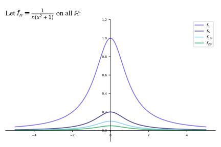

# pymath

### Example 1. Pointwise Convergence

Thus,  converges pointwise to  on .

### Example 2. Uniform Convergence

For any fixed , we can see that  so that  is the pointwise limit of the sequence  on . **Is this convergence uniform?** The observation that  implies that

Thus, given , we can choose  (which does not depend on ), and it follows that for every  implies . By Definition,  uniformly on .

